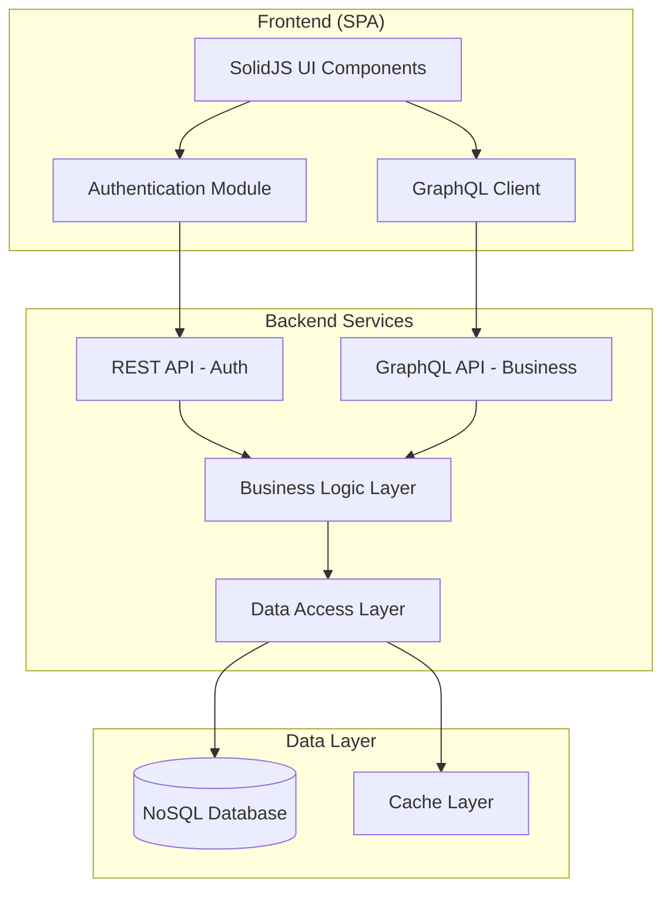

# Design Document

## Overview

The restaurant reservation system follows a clean architecture approach with clear separation between presentation, business logic, and data layers. The system is built as a monorepo containing both backend services and a single-page application (SPA) frontend. The backend provides dual API interfaces: RESTful endpoints for authentication services and GraphQL endpoints for business operations.

## Architecture

### High-Level Architecture



### Technology Stack

- **Backend**: Node.js with TypeScript
- **Database**: NoSQL (Couchbase recommended, MongoDB as alternative)
- **API Layer**: Express.js for REST, Apollo Server for GraphQL
- **Frontend**: SolidJS with TypeScript
- **Testing**: Jest for unit tests, Cucumber for BDD tests
- **Containerization**: Docker
- **Build System**: Monorepo with shared packages

## Components and Interfaces

### Backend Components

#### 1. Authentication Service (REST API)

```typescript
interface AuthController {
  login(credentials: LoginRequest): Promise<AuthResponse>;
  logout(token: string): Promise<void>;
  validateToken(token: string): Promise<UserInfo>;
}

interface LoginRequest {
  username: string;
  password: string;
}

interface AuthResponse {
  token: string;
  user: UserInfo;
  expiresIn: number;
}
```

#### 2. Reservation Service (GraphQL API)

```typescript
interface ReservationResolver {
  // Queries
  getReservations(filter: ReservationFilter): Promise<Reservation[]>;
  getReservation(id: string): Promise<Reservation>;

  // Mutations
  createReservation(input: CreateReservationInput): Promise<Reservation>;
  updateReservation(
    id: string,
    input: UpdateReservationInput
  ): Promise<Reservation>;
  cancelReservation(id: string): Promise<Reservation>;
  updateReservationStatus(
    id: string,
    status: ReservationStatus
  ): Promise<Reservation>;
}
```

#### 3. Business Logic Layer

```typescript
interface ReservationService {
  createReservation(data: CreateReservationData): Promise<Reservation>;
  updateReservation(
    id: string,
    data: UpdateReservationData
  ): Promise<Reservation>;
  cancelReservation(id: string): Promise<Reservation>;
  getReservationsByDateAndStatus(
    date: Date,
    status?: ReservationStatus
  ): Promise<Reservation[]>;
  updateStatus(
    id: string,
    status: ReservationStatus,
    updatedBy: string
  ): Promise<Reservation>;
}

interface ValidationService {
  validateReservationData(data: CreateReservationData): ValidationResult;
  validateTimeSlot(arrivalTime: Date, tableSize: number): Promise<boolean>;
}
```

#### 4. Data Access Layer

```typescript
interface ReservationRepository {
  create(reservation: Reservation): Promise<Reservation>;
  findById(id: string): Promise<Reservation | null>;
  findByDateRange(startDate: Date, endDate: Date): Promise<Reservation[]>;
  findByStatus(status: ReservationStatus): Promise<Reservation[]>;
  update(id: string, data: Partial<Reservation>): Promise<Reservation>;
  delete(id: string): Promise<void>;
}
```

### Frontend Components

#### 1. Guest Interface

- Reservation Form Component
- Reservation Management Component
- Confirmation Display Component

#### 2. Employee Interface

- Reservation Dashboard Component
- Reservation Detail View Component
- Status Management Component
- Date/Status Filter Component

## Data Models

### Core Entities

```typescript
interface Reservation {
  id: string;
  guestName: string;
  guestPhone: string;
  guestEmail: string;
  arrivalTime: Date;
  tableSize: number;
  status: ReservationStatus;
  createdAt: Date;
  updatedAt: Date;
  updatedBy?: string;
  notes?: string;
}

enum ReservationStatus {
  REQUESTED = "REQUESTED",
  APPROVED = "APPROVED",
  CANCELLED = "CANCELLED",
  COMPLETED = "COMPLETED",
}

interface User {
  id: string;
  username: string;
  role: UserRole;
  createdAt: Date;
}

enum UserRole {
  EMPLOYEE = "EMPLOYEE",
  ADMIN = "ADMIN",
}
```

### Database Schema Design

#### NoSQL Document Structure (Couchbase/MongoDB)

```json
{
  "_id": "reservation::uuid",
  "type": "reservation",
  "guestName": "John Doe",
  "guestPhone": "+1234567890",
  "guestEmail": "john@example.com",
  "arrivalTime": "2024-01-15T19:00:00Z",
  "tableSize": 4,
  "status": "REQUESTED",
  "createdAt": "2024-01-10T10:00:00Z",
  "updatedAt": "2024-01-10T10:00:00Z",
  "updatedBy": null,
  "notes": ""
}
```

## Error Handling

### Error Classification

1. **Validation Errors**: Invalid input data, business rule violations
2. **Authentication Errors**: Invalid credentials, expired tokens
3. **Authorization Errors**: Insufficient permissions
4. **Database Errors**: Connection failures, query errors
5. **System Errors**: Unexpected application errors

### Error Response Format

```typescript
interface ErrorResponse {
  error: {
    code: string;
    message: string;
    details?: any;
    timestamp: string;
    requestId: string;
  };
}
```

### Logging Strategy

- **Structured Logging**: JSON format with consistent fields
- **Log Levels**: ERROR, WARN, INFO, DEBUG
- **Context Tracking**: Request ID, user ID, operation type
- **Performance Metrics**: Response times, database query performance

## Testing Strategy

### Unit Testing

- **Business Logic**: Test all service methods and validation rules
- **Data Access**: Test repository methods with mock database
- **API Endpoints**: Test REST and GraphQL resolvers
- **Frontend Components**: Test component behavior and user interactions

### Integration Testing

- **API Integration**: Test complete request/response cycles
- **Database Integration**: Test with actual database connections
- **Authentication Flow**: Test login/logout and token validation

### End-to-End Testing

- **User Workflows**: Test complete guest and employee workflows
- **Cross-browser Testing**: Ensure SPA works across browsers
- **API Contract Testing**: Ensure API contracts are maintained

### Testing Tools

- **Unit Tests**: Jest with TypeScript support
- **BDD Tests**: Cucumber for behavior-driven testing
- **API Testing**: Supertest for HTTP endpoint testing
- **Frontend Testing**: Solid Testing Library

## Security Considerations

### Authentication & Authorization

- JWT tokens for session management
- Role-based access control (RBAC)
- Token expiration and refresh mechanisms
- Secure password hashing (bcrypt)

### Data Protection

- Input validation and sanitization
- SQL injection prevention (parameterized queries)
- XSS protection in frontend
- CORS configuration for API access

### Infrastructure Security

- Environment variable management
- Database connection security
- HTTPS enforcement
- Rate limiting for API endpoints

## Performance Considerations

### Database Optimization

- Indexing on frequently queried fields (date, status)
- Connection pooling for database connections
- Query optimization for complex filters

### Caching Strategy

- In-memory caching for frequently accessed data
- Cache invalidation on data updates
- Session caching for authenticated users

### Frontend Performance

- Code splitting for SPA
- Lazy loading of components
- GraphQL query optimization
- Bundle size optimization
